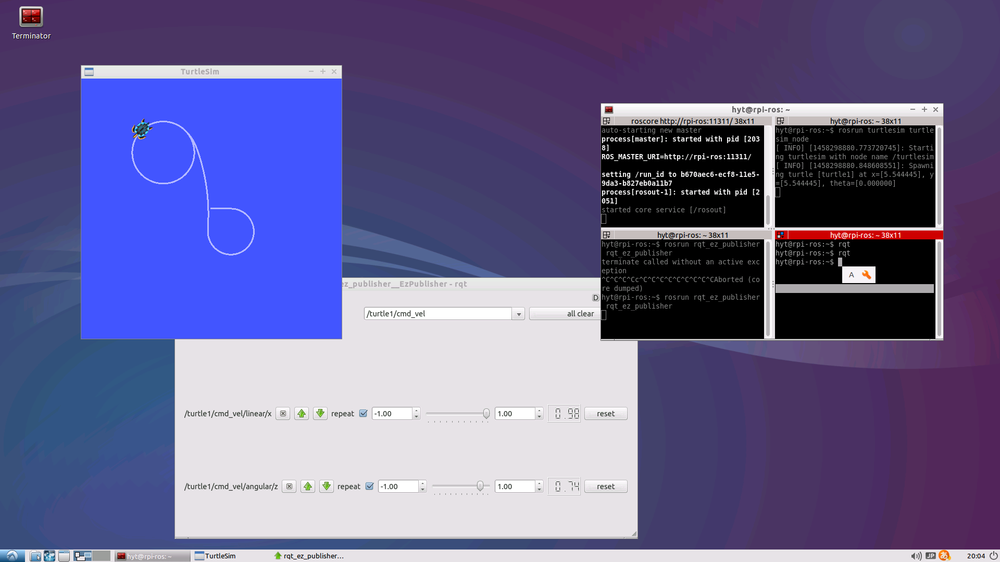

# Rasberry Pi 2 Ubuntu setup shell scripts
Raspberry Pi 2上にUbuntu14.04をインストールし、ROSを実行するための環境を作ります。  
日本語の環境とデスクトップ環境を構築します。  
併せて、IDEや開発に便利なツールを入れるためのスクリプトです。  

## 前提条件
Ubuntu 14.04 LTS ARM版をインストールする  
https://wiki.ubuntu.com/ARM/RaspberryPi  
Win32DiskImager等で書き込みを行います。  
上記のURLのイメージをmicroSDに書き込んだ状態から始めます。

### 注意点
sshで操作するのを前提としています。  
コマンド打ってファイアフォールの設定ができる方を除き、セキュリティのためプライベートなLAN内で実行する事を推奨します。  

## ツール
sshで操作するのでsshのクライアントが必要です。  
Windowsの場合は、RLoginを推奨します。

## 作業手順
下記の手順で作業を行います。

1. 前提条件のところで書き込んだmicroSDをRPi2に挿す
2. マウス、キーボード、HDMIのディスプレイを接続して起動
3. 00_manual_setup.mdの通りに、コマンドをキーボードで打ち込みmicroSDの領域をフルに利用できるようにする
4. 00_manual_setup.mdの最後で確認したip宛に、自分で作成したユーザーを使いsshでログインする
5. SFTP機能を使って、このリポジトリにあるshファイルを転送する
6. シェルに実行権限を付与する(chmod +x *.sh)
7. ファイル名の番号順に実行する(./NN_filename.sh)

## インストール後
下記のような環境が構築されます。定番の亀を動かしているところです。  

